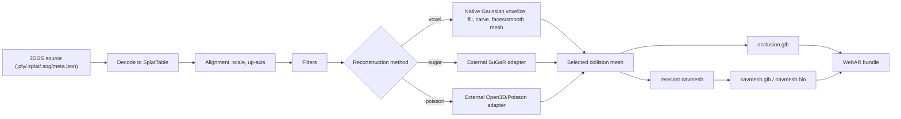

# augmented-gaussian

3D Gaussian Splatting to AR geometry processing tool.

## Current Build

This repository is now a Cargo workspace with:

- `crates/core-lib`: Rust processing core
- `crates/cli`: `augmented-gaussian-cli`
- `apps/desktop`: React/Vite/Tauri shell with PlayCanvas preview

Implemented processing path:

```text
.splat/.ply/.sog/meta.json -> alignment bake -> filters -> reconstruction selector -> collision mesh -> rerecast navmesh -> GLB/BIN/WebAR ZIP
```



Reconstruction methods:

| Method | Best fit | Tradeoff |
| --- | --- | --- |
| `voxel` | Fast collision and interior/room scenes where solid/empty volume matters. | Lower surface fidelity when voxel size is coarse. |
| `sugar` | High-fidelity surface extraction through [Anttwo/SuGaR](https://github.com/Anttwo/SuGaR) or related [2D-SuGaR](https://arxiv.org/abs/2605.00569) pipelines. | External PyTorch/conda/GPU setup; slower and not bundled. |
| `poisson` | Object and exterior point-cloud style reconstruction through Open3D/MeshLab Poisson. | External Python/Open3D setup; less AR-specific than voxel fill/carve. |

Implemented artifacts:

- `manifest.json`
- `index.html` PlayCanvas viewer with local `assets/js/playcanvas.min.js`
- `scene.sog` generated from the calibrated/filtered SoA table as a SOG V2 bundle with lossless WebP textures
- `collision_mesh.json`
- `occlusion.glb`
- `navmesh.glb` and `navmesh.bin` when the generated mesh contains walkable surfaces
- `webar.zip`

Recipe filters:

- `filterOpacity`
- `filterBox`
- `filterSphere`
- `filterCluster`
- `filterFloatersByVoxelContribution`

## CLI

```bash
cargo run -p augmented-gaussian-cli -- process \
  tests/fixtures/minimal.splat \
  --out target/e2e/splat \
  --config tests/config/basic.json
```

With calibration/edit recipe:

```bash
cargo run -p augmented-gaussian-cli -- process \
  /path/to/source.splat \
  --out target/processed/scene-a \
  --config tests/config/basic.json \
  --recipe /path/to/recipe.json
```

If `--out` is empty or points to the export root `~/Downloads/augmented-gaussian`, the CLI writes to a timestamped child folder:

```text
~/Downloads/augmented-gaussian/<input-file-name>_<unixMillis>/
```

If that folder already exists, `_1`, `_2`, and so on are appended. Explicit child directories such as `~/Downloads/custom/foo` are used as-is. `~` is expanded using the platform home directory; artifact URLs inside WebAR remain relative and use browser-friendly `/` separators.

Recipe shape:

```json
{
  "alignmentRecipe": {
    "floorNormal": [0.0, 1.0, 0.0],
    "upAxis": "y",
    "scalePoints": [[0, 0, 0], [2, 0, 0]],
    "scaleDistanceMeters": 2.0,
    "origin": [0, 0, 0]
  },
  "editRecipe": {
    "operations": [
      {
        "type": "filterCluster",
        "coarseVoxelSize": 0.5,
        "opacityThreshold": 0.05,
        "seedPos": [0, 0, 0]
      }
    ]
  }
}
```

Config may also select reconstruction:

```json
{
  "reconstruction": {
    "method": "voxel",
    "adapterCommand": null,
    "targetTriangles": 50000,
    "timeoutSeconds": 900
  }
}
```

For `"method": "sugar"` or `"method": "poisson"`, `adapterCommand` must launch a process that reads request JSON from stdin and writes response JSON to stdout:

```json
{
  "meshJson": "path/inside/resolved/outDir/mesh.json",
  "warnings": ["optional warning"]
}
```

The mesh JSON must use the existing collision mesh schema: `vertices`, `indices`, and `triangles_before_merge`. The adapter output path is rejected if it is outside the resolved output directory. For strict filesystem sandboxing of third-party adapters, run the adapter command through an OS/container sandbox wrapper.

Example adapter environments:

- SuGaR: create a conda environment with PyTorch/CUDA matching the [SuGaR](https://github.com/Anttwo/SuGaR) project, then point `adapterCommand` at a thin wrapper that converts the filtered PLY into the expected SuGaR extraction command and emits mesh JSON.
- Poisson: create a Python environment with `open3d`, run Poisson reconstruction on the filtered PLY, decimate toward `targetTriangles`, then emit mesh JSON.

`floorNormal` is a 3D unit vector indicating the orientation of the floor plane. The system calculates it automatically.
`upAxis` accepts `x`, `y`, `z`, `neg-x`, `neg-y`, `neg-z`. Omit `origin` unless the scan needs a specific world origin reset.

Benchmark with CPU/GPU voxel parity:

```bash
cargo run -p augmented-gaussian-cli -- benchmark \
  --input tests/fixtures/minimal.splat \
  --out docs/evaluation/results/bench-smoke \
  --config tests/config/basic.json \
  --compare-cpu-gpu
```

Benchmark mode disables WebAR ZIP compression so CPU/GPU timings do not include large archive costs.

Generate benchmark scenes used by the evaluation report:

```bash
cargo run -p augmented-gaussian-cli -- generate-bench-scenes --out target/bench-scenes
```

## GUI

```bash
cd apps/desktop
pnpm install
pnpm run build
pnpm run tauri dev
```

GUI workflow:

1. Enter source path and output dir.
2. Click `Load`.
3. Pick two scale endpoints and enter real distance in meters.
4. Select up axis.
5. Click `Bake`.
6. Click `Save ZIP` if a second copy of the WebAR bundle is needed.

GUI sends file paths, config JSON, and recipe JSON to the Rust backend. It does not send large mesh blobs over Tauri IPC.
The PlayCanvas preview loads the selected source through Tauri's asset protocol, shows calibration grid/up-vector/markers, and serializes the locked alignment recipe before bake.
Available Tauri commands: `load_source`, `process_job`, `cancel_job`, `save_bundle`, `export_edited_source`.

## Expected Output

`process` writes these files under the resolved output directory:

- `manifest.json`: schema version 2, resolved output directory, source counts, calibrated transform/unit scale, calibrated bounds, artifact names, reconstruction method/timing, CPU/GPU parity when applicable, mesh metrics, geometric error, file-size ratios
- `scene.sog`: calibrated and filtered splat bundle
- `collision_mesh.json`: collision mesh vertices/indices for inspection
- `occlusion.glb`: WebAR occlusion/collision mesh
- `navmesh.glb` and `navmesh.bin`: only when `rerecast` produces walkable polygons
- `index.html` plus `assets/js/playcanvas.min.js`: local PlayCanvas validation viewer
- `webar.zip`: self-contained WebAR bundle when `export.writeWebarZip` is true

If no walkable surface exists, `manifest.artifacts.navmeshGlb` and `manifest.artifacts.navmeshBin` are `null`, and stale `navmesh.*` files are removed from the output directory.

## WebAR Smoke

```bash
cd apps/desktop
pnpm run test:e2e
```

## Verification

```bash
cargo test --workspace
cd apps/desktop && pnpm test
cd apps/desktop && pnpm run build
cd apps/desktop && pnpm run test:e2e
cd apps/desktop && pnpm run tauri build
```
